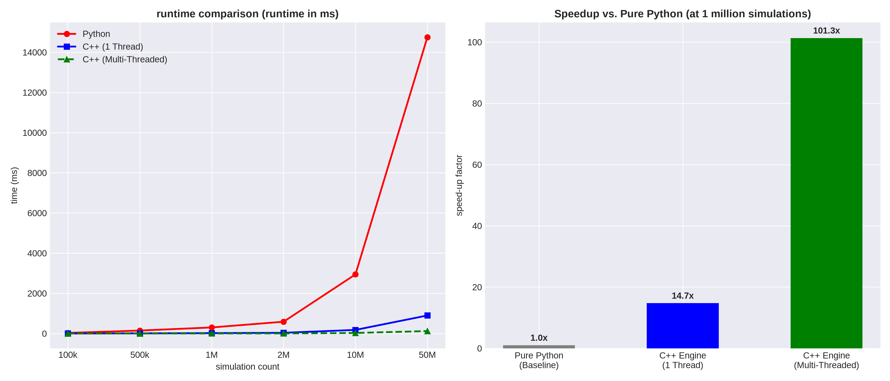

# Multithreaded Option Pricing Engine (C++17 & Python)

<div align="center">

[](https://en.cppreference.com/w/cpp/17)
[](https://www.python.org/)
[](https://github.com/pybind/pybind11)

[English](README.eng.md) | [German](README.md)

**A multithreaded option pricing engine in C++17 for pricing European options and calculating sensitivities (Greeks). The project utilizes **pybind11** to expose the C++ core to Python as a native module.**

</div>

---

## About the Project

This project provides a high-performance quantitative finance engine for **Option Pricing** and Risk Metrics. By combining the processing speed of modern **C++17 (multithreading via `std::thread`)** with the flexibility of **Python (via `pybind11`)**, this engine delivers fast Monte Carlo simulations and analytical Black-Scholes Greeks directly in Python.



---

## Key Features

<details open>
<summary><b>Overview of Core Features (Click to collapse)</b></summary>

- **Analytical Black-Scholes Model:** Exact pricing & analytical Greeks ($\Delta, \Gamma, \mathcal{V}, \Theta, \rho$).
- **Multi-Threaded Monte Carlo Engine:** Stochastic simulations with parallel thread distribution.
- **Numerical Finite-Difference Greeks:** Flexible approximation of Delta ($\Delta$) and Gamma ($\Gamma$) via central difference quotients.
- **Native Python Bindings:** Integration via `pybind11` as a high-performance C-extension module.
- **Modern C++ Build System:** Automatic dependency management via CMake (`FetchContent`) for **Catch2 v3** & **pybind11**.
- **Comprehensive Test Coverage:** Automated unit tests with Catch2 for mathematical precision & convergence.
</details>

---

## Installation

### Prerequisites

| Tool | Recommended |
| :--- | :--- |
| **C++ Compiler** | C++17 Standard |
| **CMake** | `>= 3.15` |
| **Python** | `>= 3.10` |

---

### Installation (Python Module)

Install the C++ module directly into your Python environment:

```bash
# Clone repository
git clone https://github.com/ducks-csv/option-pricing-engine.git
cd option-pricing-engine

# Create & activate virtual environment
python3 -m venv .venv
source .venv/bin/activate  # Windows: .venv\Scripts\activate

# Build and install module
pip install -e .
```

---

### Build Standalone C++ & Tests

```bash
# Create build directory
mkdir build && cd build

# Configure CMake & compile
cmake ..
make -j$(nproc)

# Execution & Tests
./main_exec     # Standalone Demo
./unit_tests    # Catch2 Test Suite
```

---

## Feature Overview

Use the engine directly in your Python scripts or Jupyter Notebooks:

| Parameter | Symbol | Typ | Description |
| :--- | :---: | :---: | :--- |
| **Spot Price** | $S$ | `double` | Current price of the underlying asset. |
| **Strike Price** | $K$ | `double` | Agreed exercise price (Strike) of the option. |
| **Interest Rate** | $r$ | `double` | Annual risk-free interest rate (e.g., `0.05` for 5%). |
| **Volatility** | $\sigma$ | `double` | Annual volatility of the underlying asset (e.g., `0.2` for 20%). |
| **Maturity** | $T$ | `double` | Time to expiration in years (e.g., `1.0` for 1 year, `0.5` for 6 months). |
| **Simulations** | $N$ | `size_t` | Number of simulated paths (Monte Carlo only). |
| **Threads** | - | `unsigned int` | Number of parallel threads for Monte Carlo simulation (Default = 0 -> All available). |

```python
import option_engine as oe

oe.BlackScholes.price(oe.OptionType.Call, 100.0, 100.0, 1.0, 0.05, 0.2) # analytical call price via python

oe.MonteCarlo.price(oe.OptionType.Call, 100.0, 100.0, 1.0, 0.05, 0.2, 1000000)  # monte carlo call price via python

oe.BlackScholes.greeks(oe.OptionType.Call, 100.0, 100.0, 1.0, 0.05, 0.2)    # call greeks black-scholes

oe.MonteCarlo.greeks(oe.OptionType.Call, 100.0, 100.0, 1.0, 0.05, 0.2, 1000000) # call greeks monte carlo
```

Alternatively, use `oe.OptionType.Put` to calculate the put price.

---

## Benchmark & Performance

benchmark comparison between Python and C++17:

```bash
python benchmark.py
```

## Mathematical Background

### 1. Black-Scholes Model (Analytical)
The price of a European call option is given by:

$$C(S, t) = S \cdot N(d_1) - K \cdot e^{-rT} \cdot N(d_2)$$

where:

$$d_1 = \frac{\ln(S/K) + (r + \frac{\sigma^2}{2})T}{\sigma \sqrt{T}}, \quad d_2 = d_1 - \sigma \sqrt{T}$$

### 2. Monte Carlo Simulation
Stock price dynamics are simulated using Geometric Brownian Motion:

$$S_T = S_0 \cdot \exp\left(\left(r - \frac{\sigma^2}{2}\right)T + \sigma \sqrt{T} \cdot Z\right), \quad Z \sim \mathcal{N}(0, 1)$$

### 3. Greeks via Central Finite Difference
For Monte Carlo, Delta and Gamma are approximated by evaluations at $S \pm h$:

$$\Delta \approx \frac{\text{Price}(S + h) - \text{Price}(S - h)}{2h}$$

$$\Gamma \approx \frac{\text{Price}(S + h) - 2 \cdot \text{Price}(S) + \text{Price}(S - h)}{h^2}$$

---

## Project Structure

```text
option_pricing_engine/
├── CMakeLists.txt         # CMake Setup (Catch2 & pybind11)
├── pyproject.toml         # Python Build System Specification
├── setup.py               # C++ Extension Builder via setuptools
├── benchmark.py           # Benchmark script
├── include/
│   ├── black_scholes.hpp  # Analytical formulas & Greeks Struct
│   └── monte_carlo.hpp    # Parallelized MC engine
├── src/
│   ├── black_scholes.cpp  # Black-Scholes implementation
│   ├── monte_carlo.cpp    # Multithreaded MC algorithm
│   ├── bindings.cpp       # pybind11 Python bindings
│   └── main.cpp           # C++ standalone demonstration
└── tests/
    ├── test_black_scholes.cpp
    └── test_monte_carlo.cpp
```

---

Released under the [MIT License](LICENSE).